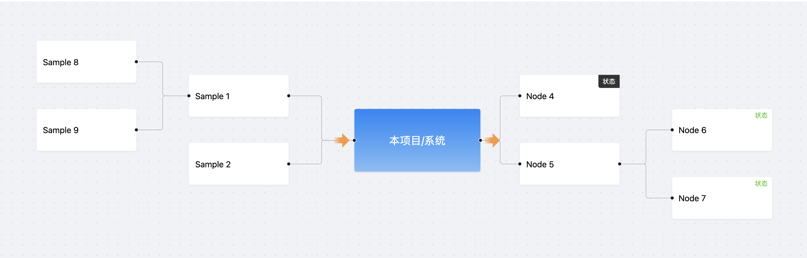
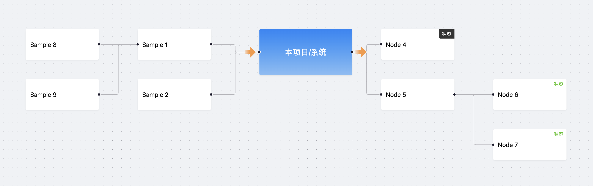
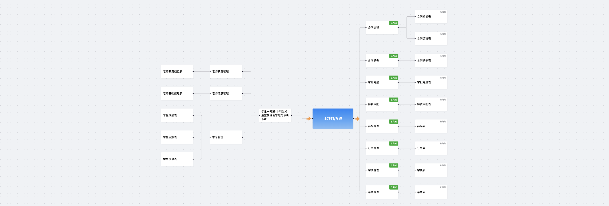

# bigger-flow

### 介绍

`bigger-flow` 是一个基于 `@xyflow/react` 和 `dagre` 的关系矩阵组件，旨在简化复杂关系图的展示和管理。它提供了自动布局功能，使用户能够轻松地可视化节点和它们之间的连接关系。

**简单案例**



**复杂案例**


### 使用教程

**Step 1: 安装依赖**

```bash
npm install bigger-flow
# OR
pnpm add bigger-flow
```

**Step 2: 引入组件**

```ts
import { RelationMatrix } from 'bigger-flow';
import 'bigger-flow/lib/styles.css';
```

**Step 3: 使用组件**

```tsx
import { RelationMatrix, ReactFlowProvider, type RelationMatrixNode, type RelationMatrixEdge } from 'bigger-flow'

// 描述节点
const nodes: RelationMatrixNode[] ={
  {
    id: '1',
    data: { label: 'Sample 1' },
    type: 'sample',
  },
  {
    id: '2',
    data: { label: 'Sample 2' },
    type: 'sample',
  },
}

// 描述连线
const edges: RelationMatrixEdge[] = {
  { source: '1', target: '2' },
}

export const App = () => {
  return (
    <ReactFlowProvider>
      <RelationMatrix
        nodes={nodes}
        edges={edges}
        layout='dagre'
        flowProps={{ fitView: true }}
        backgroundProps={{ bgColor: '#f0f2f5' }}
      />
    </ReactFlowProvider>
  );
};

```

### 本地启动事例代码

```bash
pnpm install
pnpm dev
```

### 类型描述

```typescript

// RelationMatrix 组件 props
export type RelationMatrixProps = {
  nodes?: RelationMatrixNode[] // node 节点
  edges?: RelationMatrixEdge[] // edge 连线
  layout?: 'dagre' | false // 自动布局
  direction?: Direction // 布局方向 'TB' | 'LR'
  fitViewOnResize?: boolean // 是否在窗口大小变化时适应视图
  flowProps?: ReactFlowProps // 传递给 ReactFlow 的属性。参阅：@xyflow/react 的 ReactFlowProps
  backgroundProps?: BackgroundProps // 传递给 Background 的属性。参阅：@xyflow/react 的 BackgroundProps
  dagreOptions?: Partial<DagreGraphOptions> // dagre 布局配置，layout=dagre有效。参阅： @dagrejs/dagre 的 GraphLabel 配置
}


// RelationMatrixNode 节点类型
export type RelationMatrixNode = {
  id: string
  type: keyof typeof nodeTypes // 仅支持 sample 类型
  data: SampleData // 这个传递控制 sample 的数据
 } & Partial<Omit<Node, 'data' | 'type' | 'id'>>

// SampleData 节点类型
export type SampleData = {
  label: string
  // 样式
  style?: React.CSSProperties
  // className?: string
  className?: string
  // 方向
  direction?: Direction
  // 动态 handle
  dynamicHandle?: boolean
  // 是否自定义 render
  render?: (element: ReactElement, nodeProps: NodeProps) => ReactNode
  // 扩展渲染
  extraRender?: (element: ReactElement | null, nodeProps: NodeProps) => ReactNode
  // sample node 容器属性，可以添加事件或者ref
  elementProps?: HTMLProps<HTMLDivElement>
  // 角标定义
  marker?: {
    label: string
    color?: string
    backgroundColor?: string
    type?: 'line' | 'outline'
    style?: React.CSSProperties,
    render?: (element: React.ReactNode, node: NodeProps) => React.ReactNode
  }
  // 其他数据
  [index: string]: any
}

// 连线节点
export type RelationMatrixEdge = Omit<Edge, 'id'> & { id?: string }
```
